# Analysis of Ideological Polarization on Social Networks Based on the Spread of Disinformation Content
### Final Project – Data Processing (Master in Telecommunication Engineering)  
### December 2025

### Manuel Garde Granizo, Jose Ignacio Aguilar Anguita

---

## 1. Problem Description

The spread of disinformation on social networks has a strong impact on public perception and can reinforce ideological polarization. Misleading or unverified information tends to propagate quicker than verified content, especially within ideologically homogeneous communities.

**Objective:**  
To analyze how rumour-like (disinformative) content spreads and whether it reflects linguistic patterns associated with polarization. This includes:

- Detecting whether posts are **true**, **false**, or **unverified**  
- Comparing several text-vectorization strategies  
- Evaluating classical ML models, neural networks, and fine-tuned transformers  
- Interpreting whether rumour content shows linguistic polarization cues (emotion, stance, uncertainty)

---

## 2. Dataset Description

We use the **PHEME Rumour Scheme Dataset** [[1]](#1), containing Twitter posts annotated as **Missinformation** (True/False) and **True** (0/1).
In order to provide veracity of the Tweet, those labels are mapped into:

- Missinformation & True == 0 → "Unverified"
- Missinformation == 0 & True == 1 → "Verified"
- Missinformation == 1 & True == 0 → "False"
- Missinformation == 1 & True == 1 → "ERROR!!"

It includes source tweets and full reply threads across multiple major news events.

### Dataset Summary  
- **Total posts:** 2402 Rumour Tweets  
- **Events:** e.g., Charlie Hebdo, Sydney Siege, Germanwings Crash  
- **Classes:**  
  - True: *1067*  
  - False: *638*  
  - Unverified: *697*  
- **Average post length:** *[n]* tokens  

### Initial Hypotheses  
1. False and unverified posts use more uncertain or emotional vocabulary.  
2. Transformer-based embeddings will outperform TF-IDF and Word2Vec.  
3. The *unverified* class will be the most difficult to classify.

---

## 3. Methodology

Copy repo into local machine:

<pre> bash: ~$ git clone https://github.com/MGG-02/Data-Processing25-26.git </pre>

### 3.1 Exploratory Analysis  

<pre> bash: ~$ python3 DataBasicStats-GenDescript.py </pre>

- Dataset dimentions, data types and dataset samples  
- Missing values  
- Basic stats for numerical values (count, mean, std)  
- Target Distribuition and samples for each veracity label
- WordCloud  

---

## 3.2 Text Vector Representations

Three different text vectorization strategies are compared:

### **A) TF-IDF**

_Term Frequency-Inverse Document Frequency_ is a text vectorization technique that expresses how relevant a word in a document is. Given by its formula:

$$TF = \frac{BoW (w, d)}{\text{nº words in d}} \space \space ; \space \space IDF = \log{\frac{\text{nº Docs}}{\text{nº Docs with term w}}}$$

$$TF-IDF = TF(w,d) \times IDF (w)$$

  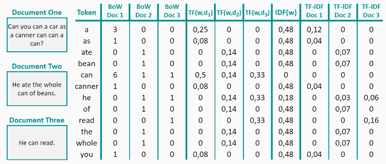
   
  <em>Figure 1: TF-IDF Vectorization Example</em>

The main purpouse for TF-IDF vectorization is counting words and deciding weather a word is more or less important in order to detect the topic/sentimient/etc.

### **B) Word2Vec**

_Word2Vec_ is a neural embedding model that learns dense, low-dimensional vectors for each word by predicting its surrounding context (skip-gram) or by predicting the word from its context (CBOW). 

  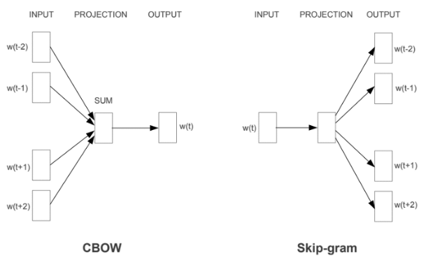
   
  <em>Figure 2: Functional schemes for CBOW and Skip-gram Word2Vec models</em>

To obtain a fixed-size representation for each tweet, the **average of all word embeddings** is computed, compressing the lexical content into a dense embedding that:

  - Captures semantic similarities beyond exact word overlap (unlike pure counts in TF-IDF).
  - Reduces dimensionality compared to sparse bag-of-words representations
  - Provides a simple, efficient input for classical classifiers and neural networks.

However, Word2Vec embeddings are static and do not model word sense or sentence-level context (the same word has the same vector in every tweet). As a result, this embeddings are less expresive than transformed-based ones (e. g. BERT) when dealing with subtle cues of stance, uncertainity or irony in disinformation.

### **C) Transformer-Based Embeddings**
**BERT** Embeddings: The previous text vectorization techniques are unable to capture context in the sentences, this is why, the last vectorization used is BERT. BERT (_Bidirectional Encoder Representations from Transformers_) is a pretrained language model that uses bidirectional context to enhance performance on natural language processing tasks.[[2]](#2)

  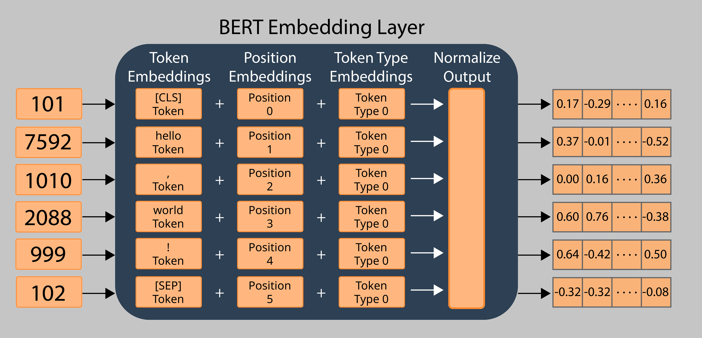
   
  <em>Figure 3: Example on how BERT Embedding layer tokenize text</em>

Because BERT captures nuanced semantic and emotional signals, it is particularly well-suited for detecting disinformation patterns and ideological polarization in social media posts.

BERT excels at:
  - Capturing subtle sentiment and linguistic cues
  - Understanding stance, irony, or emotionally charged language
  - Differentiating between factual vs. manipulative phrasing
  - Modeling ideologically polarized vocabulary shifts
  
---

## 3.3 Classification Models

### **Classical Models (Scikit-Learn)**

In order to create models able to classify weather a Tweet is _True_, _False_ or _Unverified_, several Scikit-Learn Classifiers have been selected:

- Logistic Regression
- SVM  
- Random Forest  

In order to give a better explanation of the functional behaviour of these classification models, it is important to have in mind that they are multiclass, as the aim is to distinguish between three types of tweets, as mentioned previously.

#### **Logistic Regression**
Logistic regression model predicts one of many possible categories for a given input based on the computation of the probability of this input to be linked to each category using a softmax function, ensuring the sum of all these probabilities is always the unity [[3]](#3). The softmax formula is:

$$P(y = k) = \frac{e^{z_k}}{\sum_j e^{z_j}}$$

Where $z_k$ is the raw score for each class and the denominator term is the sum of all class scores used for normalization.

#### **Support Vector Machine (SVM)**
SVM model is designed to separate data points into two different classes by finding the optimal hyperplane that maximizes the margin between the clases. When using more than two classes, it is necessary to apply the algorithm for every possible pair of classes (One-vd-One approach), or to train a different algorithm for each class (One-vs-All approach) [[4]](#4). This way, it is possible to sepparate data into three different regions, as shown in the figure below.

  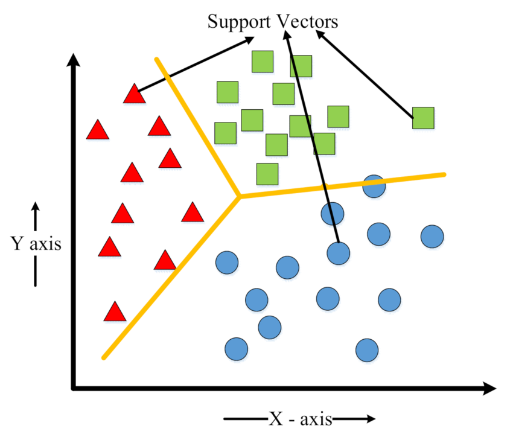
   
  <em>Figure 4: Multiclass classification model application on data points (SVM)</em>

Logist Regression model also creates boundaries between data points, based on the probabilities estimated as mentioned previously, resulting in a similar approach as the one shown in Figure 4.

#### **Random Forest**
Random forest model uses diverse decision trees to make better predictions looking at different random parts of the data and their results are combinedcby voting. This improves accuracy and reduces errors very effectively and, because of its structure (Figure 5), it allows to show the importance of each feature (column) for making predictions, helping in understanding datasets information in a better way [[5]](#5).

  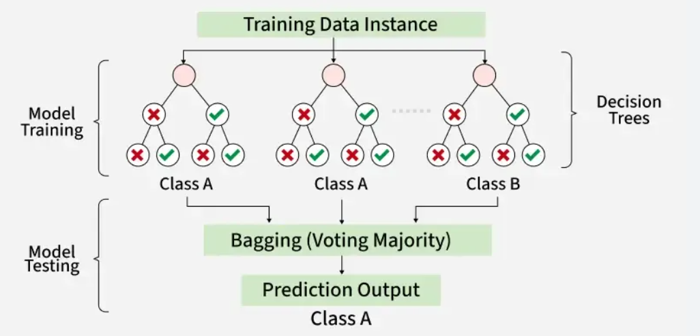
   
  <em>Figure 5: Random Forest classification model functional schematic.</em>

All the features, pros and cons of the previously explained classification models are summarized in the table shown below.

| Model | Type | Captures Nonlinearity | Pros | Cons | Works Well With |
|-------|------|-----------------------|------|------|-----------------|
| **Logistic Regression** | Linear | No | Simple, fast, interpretable, strong baseline | Limited for complex patterns | High-dimensional embeddings (TF-IDF, BERT) |
| **SVM** | **Linear**/Nonlinear | Yes (with kernels) | Strong performance, robust to outliers | Slow on large datasets, requires tuning | High-dimensional features (especially linear kernel) |
| **Random Forest** | Tree Ensemble | Yes | Captures complex patterns, robust to noise, feature importance | Weak on dense high-dimensional embeddings, can overfit | Tabular data or sparse text vectors |

### **PyTorch Neural Network**

To explore different ways of Tweet classification/Spread of desinformation, a Pytorch Neural Network has been created. Neural Networks (**NN**) can learn nonlinear relationships that scikit-learn models struggle with. This is usefull when working with text representation via embeddings, where context vectors dimentions are complex.

Another advantage of NN is the high customization of the model, where dimension and number of layers, activation functions, dropout, loss function, optimizers, etc can be tunned in order to increase performance, reduce loss and increase accuracy.

To end up with the advantages of NN, Pytorch provides GPU acceleration, meaning that the created model can be tranfered to the GPU to increase training, validation and test speed.

For each vectorization technique, the following neural network configurations have been used.

#### **TF-IDF vectorization**

  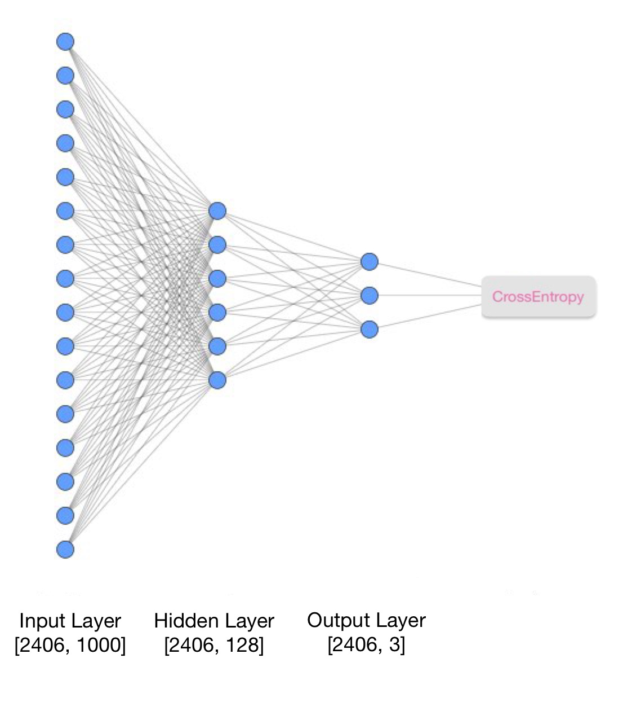
   
  <em>Figure 6: Pytorch NN for Classification via TF-IDF Vectorization</em>

*   **Architecture**: Shallow network with 1 hidden layer (128 units).
*   **Activation**: **GELU** (Gaussian Error Linear Unit).
*   **Details**: optimized for high-dimensional sparse inputs from TF-IDF.

#### **Word2Vec vectorization**

  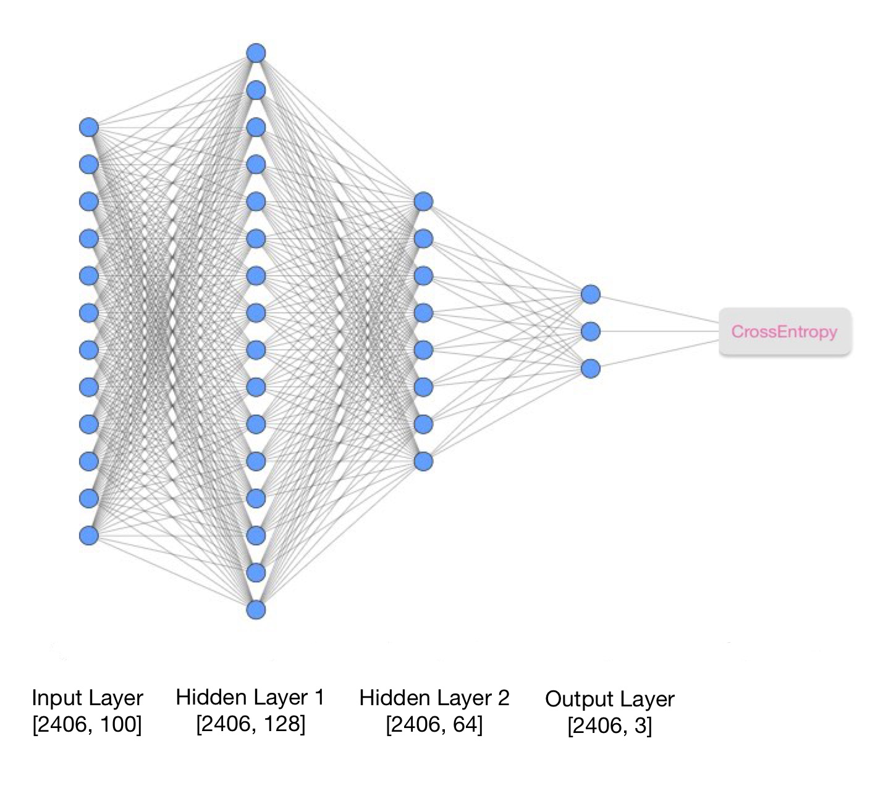
   
  <em>Figure 7: Pytorch NN for Classification via Word2Vec Vectorization</em>

*   **Architecture**: Deep network with 2 hidden layers (128 $\to$ 64 units).
*   **Activation**: **PReLU** (Parametric ReLU).
*   **Details**: Uses **LayerNorm** for stability with dense embeddings and dropout for regularization.

#### **BERT vectorization**

  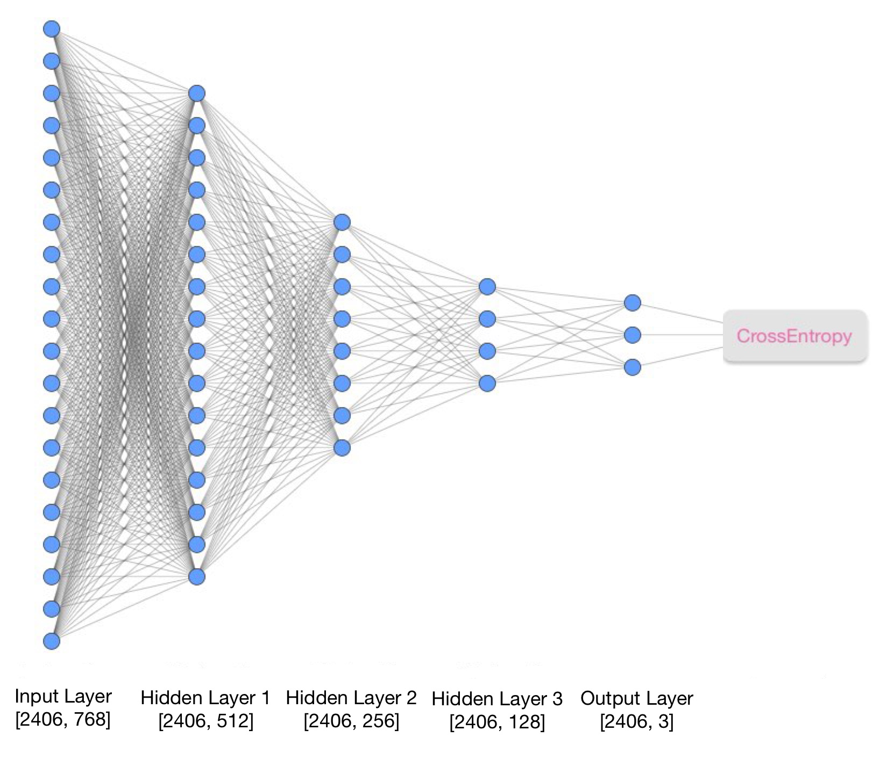
   
  <em>Figure 8: Pytorch NN for Classification via BERT Vectorization</em>

*   **Architecture**: Deep Multi-Layer Perceptron (MLP) (512 $\to$ 256 $\to$ 128 units).
*   **Activation**: **GELU**.
*   **Details**: Acts as a classification head on top of BERT embeddings, using dropout to prevent overfitting.

## 4. Results

### Training Convergence
To validate the training process of the neural network models, we analyze the evolution of their Loss and Accuracy metrics over the training epochs.

**TF-IDF Neural Network Training:**
The plot below shows the training performance of the PyTorch NN using TF-IDF vectors. We observe the Training and Validation Loss decreasing, indicating the model is learning without immediate overfitting.

  
   
  <em>Figure 9: Training and Validation metrics for TF-IDF Neural Network</em>

**Word2Vec Neural Network Training:**
Here we display the convergence for the Word2Vec-based Neural Network. The validation accuracy stabilizes, suggesting the model reaches its capacity given the static embeddings.

  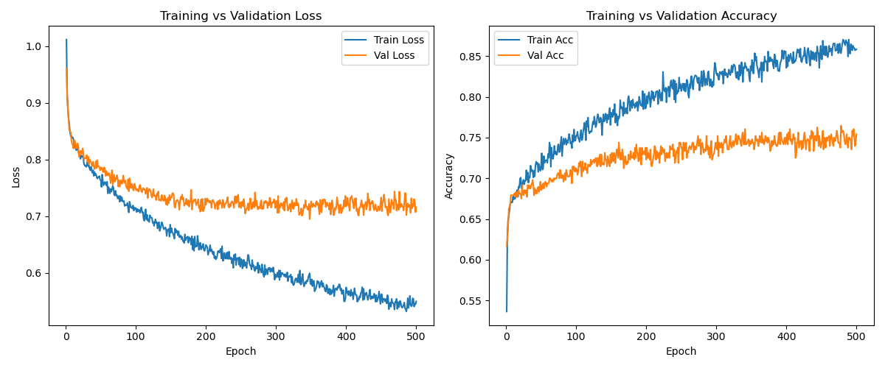
   
  <em>Figure 10: Training and Validation metrics for Word2Vec Neural Network</em>

**BERT (Feature Extraction) Neural Network Training:**
For the BERT-based classifier (using frozen embeddings), the metrics show how the dense layers adapt to the rich semantic features provided by BERT.

  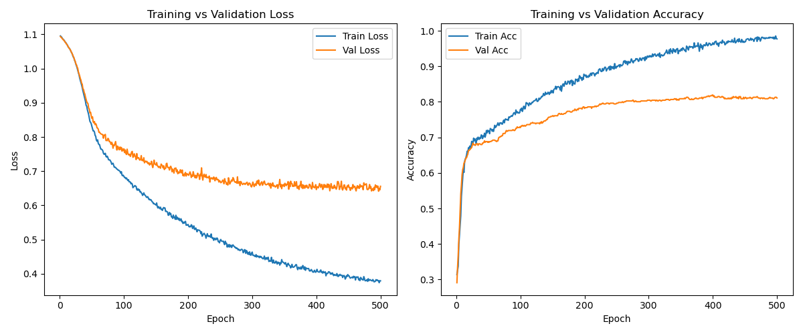
   
  <em>Figure 11: Training and Validation metrics for BERT (Feature Extraction) Neural Network</em>

**Transformer (Fine-Tuning) Training:**
Finally, this plot represents the fine-tuning process of the Transformer model (e.g., BERTweet/RoBERTa). We can see the loss minimizing as the model adapts its pre-trained weights to the specific Rumour detection task.

  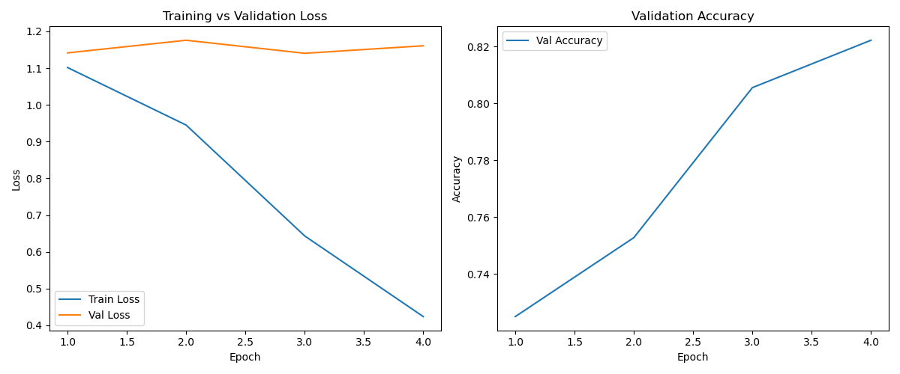
   
  <em>Figure 12: Training and Validation metrics for Fine-Tuned Transformer</em>

### Accuracy

**Accuracy** metric in classification models can be defined basically as the ratio between the hits and the complete set of examples in the predictions made, as shown in the expression below.

$$ Accuracy = \frac{TP + TN}{TP+TN+FP+FN} $$

Where TP is the true positives, TN is the true negatives, FP is the false positives and FN is the false negatives. The accuracy results obtained for each model and vectorization configurations can be observed in the tables below.

| Vectorization \ Model | Logistic Regression | SVM | Random Forest | PyTorch NN |
|-----------------------|---------------------|-----|---------------|------------|
| **TF-IDF** | 0.8338 | ***0.8643*** | 0.8366 | 0.8283 |
| **Word2Vec** | 0.7173 | 0.7588 | 0.7526 | ***0.7796*** |
| **BERT** | 0.7089 | 0.7339 | ***0.7672*** | 0.7651 |

Focusing on the performance of every classification model for each text vectorization method (rows of the above table), there is a very slight difference between the results, being different models the most adequated for each vectorization technique. This means that the performance of each configuration does not have a strong dependency on the classification model used. In addition, an accuracy of 70% to 87% has been achieved for all the cases, considering the configuration of the parameters used for each case moderately good.

| Model \ Vectorization | TF-IDF | Word2Vec | BERT |
|-----------------------|--------|----------|------|
| **Logistic Regression** | ***0.8338*** | 0.7173 | 0.7089 |
| **SVM** | **0.8643** | 0.7588 | 0.7339 |
| **Random Forest** | ***0.8366*** | 0.7526 | 0.7672 |
| **PyTorch NN** | ***0.8283*** | 0.7796 | 0.7651 |

On the other hand, there is a clear difference in performance when focusing on the vectorization technique used for each classification model, being the indisputable winner the TF-IDF method with a difference of around 10% with the other techniques. The particular case that has thrown the best result is the **TF-IF vectorization and SVM classification model**.

### F1 score

*F1 score* metric, also known as balanced F-socre, can be interpreted as the harmonic mean of *precision* (percetnage of the predicted positives which are correct) and *recall* (percentage of the correctly predicted positives over all the possible positives) [[3]](#3). It is computed as shown below.

$$F1 = \frac{2*TP}{2*TP + FP + FN}$$

Where *TP* is the number of true positives, *FP* is the number of false positives and *FN* is the number of false negatives. F1 value oscillates between 0 and 1, being the fist vale the worst case, and the last one the best case. It is a more reliable metric than the accuracy when the dataset used is strongly unbalanced, stablishing a compromise between getting false positives and loosing real positives.

Based on this metric, it is also possible to do a comparison between the performance por each classification model and text vectorization methods combined.

**(F1 Score - Weighted)**

| Model \ Vectorization | TF-IDF | Word2Vec | BERT |
|-----------------------|--------|----------|------|
| **Logistic Regression** | ***0.8340*** | 0.7180 | 0.7088 |
| **SVM** | **0.8636** | 0.7540 | 0.7299 |
| **Random Forest** | ***0.8342*** | 0.7482 | 0.7582 |
| **PyTorch NN** | ***0.8288*** | 0.7786 | 0.7621 |

**(F1 Score - Macro)**

| Model \ Vectorization | TF-IDF | Word2Vec | BERT |
|-----------------------|--------|----------|------|
| **Logistic Regression** | ***0.8311*** | 0.7118 | 0.7008 |
| **SVM** | **0.8583** | 0.7434 | 0.7197 |
| **Random Forest** | ***0.8299*** | 0.7398 | 0.7479 |
| **PyTorch NN** | ***0.8201*** | 0.7729 | 0.7530 |

(Explain)

### ROC-AUC score
*ROC-AUC* or Area Under the Receiver Operating Characteristic Curve evaluates the goodness of each model across the full spectrum of thresholds. More precisely, it is also a number between 0 and 1 that represents the area under the ROC curve that plots the true positive rate (TPR) against the false positive rate (FPR) for all possible decision thresholds, giving this way the probability that the model assigns a higher score to a randomly chosen positive example than to a randomly chosen negative one [[4]](#4). 

An example of the measure of this metric is given in the figure observed below, in which the area of the ROC  curve (orange one) represents the performance of a model for all the possible true and false possitive ratios.

  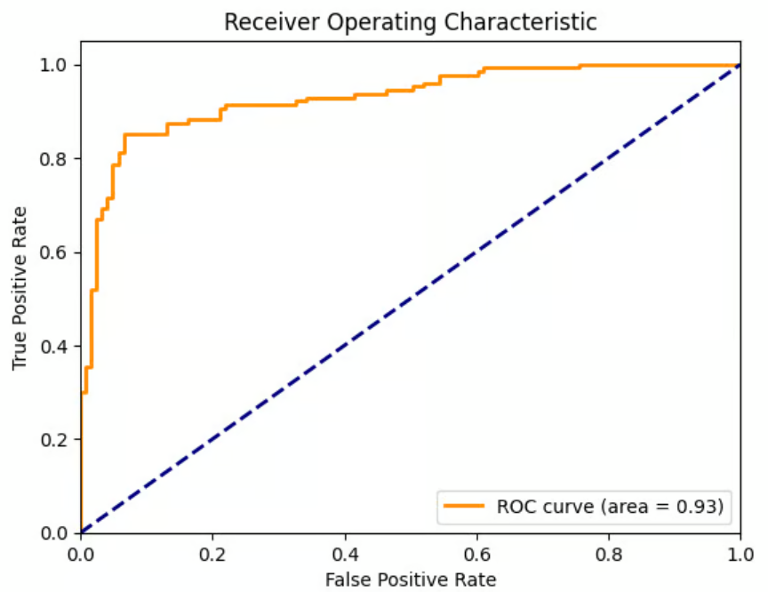
   
  <em>Figure 9: ROC curve for a logistic regression model.</em>

In essence, having a higher ROC-AUC value means that the model has the ability to give a better separation between one class an the rest of them improving the TPR over the FPR for every possible case.

The same comparison will be made for the classification models and vectorization techniques based on this metric. The results are shown in the tables below.

| Vectorization \ Model | Logistic Regression | SVM | Random Forest | PyTorch NN |
|-----------------------|---------------------|-----|---------------|------------|
| **TF-IDF** | 0.9440 | ***0.9552*** | 0.9530 | 0.9305 |
| **Word2Vec** | 0.8746 | 0.8821 | 0.8895 | ***0.9191*** |
| **BERT** | 0.8786 | 0.8729 | 0.9034 | ***0.9069*** |

Again, the same conclusion can be made for the classification models used for each vectorization method, the results are not biased enough to make a clear decision in which one is the best. However, for Word2Vec and BERT vectorization technics, the PyTorch neural network seems to throw better results than the TF-IDF one.

| Model \ Vectorization | TF-IDF | Word2Vec | BERT |
|-----------------------|--------|----------|------|
| **Logistic Regression** | ***0.9440*** | 0.8746 | 0.8786 |
| **SVM** | **0.9552** | 0.8821 | 0.8729 |
| **Random Forest** | ***0.9530*** | 0.8895 | 0.9034 |
| **PyTorch NN** | ***0.9305*** | 0.9191 | 0.9069 |

Tf-IDF is also clearly the most performative vectorization technique, giving a top ROC-AUC value of around 95% for every classification method used. 

### References
<a id="1">[1]</a> 
Kochkina, Elena; Liakata, Maria; Zubiaga, Arkaitz (2018). 
PHEME dataset for Rumour Detection and Veracity Classification. figshare.
[Dataset](https://doi.org/10.6084/m9.figshare.6392078.v1)

<a id="2">[2]</a> 
David Liang (2024).
Intro — Getting Started with Text Embeddings: Using BERT.

<a id="3">[3]</a>
shrurfu5 via Geeksforgeeks (Aug 23, 2025).
Multiclass logistic regression.

<a id="4">[4]</a>
jyotijb23 via Geeksforgeeks (Jul 23, 2025).
Multi-class classification using Support Vector Machines (SVM).

<a id="5">[5]</a>
Susmit Sekhar Bhakta via Geeksforgeeks (Oct 31, 2025).
Random Forest Algorithm in Machine Learning.

<a id="6">[6]</a>
Scikit-Learn developers (2025). 
F1_score.

<a id="7">[7]</a>
Vidhi Chug (Sep 10, 2024).
AUC and the ROC Curve in Machine Learning.
[](https://www.datacamp.com/tutorial/auc?utm_cid=19589720821&utm_aid=157098104775&utm_campaign=230119_1-ps-other%7Edsa-tofu%7Eall_2-b2c_3-emea_4-prc_5-na_6-na_7-le_8-pdsh-go_9-nb-e_10-na_11-na&utm_loc=9061038-&utm_mtd=-c&utm_kw=&utm_source=google&utm_medium=paid_search&utm_content=ps-other%7Eemea-en%7Edsa%7Etofu%7Etutorial%7Edata-analysis&gad_source=1&gad_campaignid=19589720821&gbraid=0AAAAADQ9WsFuq_Wts9SQJwXe_h0iKK09X&gclid=Cj0KCQiA9OnJBhD-ARIsAPV51xO57WVfMEA2cqKFNJtBFYEAPSppP-6Oa7EeFlJxUeviTeszGnAYK9saAv2YEALw_wcB&dc_referrer=https%3A%2F%2Fwww.google.com%2F)
